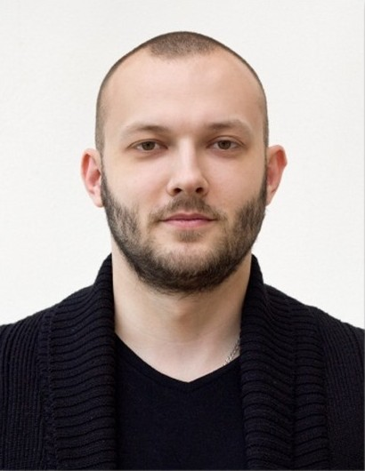

  

# Lageev Evgeniy 

***

*Front-end Developer*

## Contacts

* **Telegram:** [tostaky](https://t.me/tostaky)
* **Skype:** [Evgeniy Lageev](https://join.skype.com/invite/LHJg5RzmCT9p)
* **e-mail:** E.Lageev@gmail.com
* **Linkedin:** [Evgeniy Lageev](https://www.linkedin.com/in/lageev)
* **Discord:** tostaky  

## About Me

*I'm an enthusiastic and detail-oriented Front-end Developer seeking an entry-level position with Company to use my skills in coding, troubleshooting complex problems, and assisting in the timely completion of projects.*

## Skills

* JavaScript;
* HTML/HTML5;
* CSS/CSS3;
* Git;
* Firebase;
* MVC
* APIs
* OOP
* English Proficiency: A2

## Code example

```javascript
function multiply(a, b){
  return a * b
}
 let result = multiply(1, 2);
console.log( result );
```

## Education

* **IT Academy:**
  * **02.2022 - 05.2022** - Web applications development with JavaScript.
  * **11.2021 - 02.2022** - Website development with HTML, CSS & JavaScript.
* **Belarusian State University**, Jurisprudence
